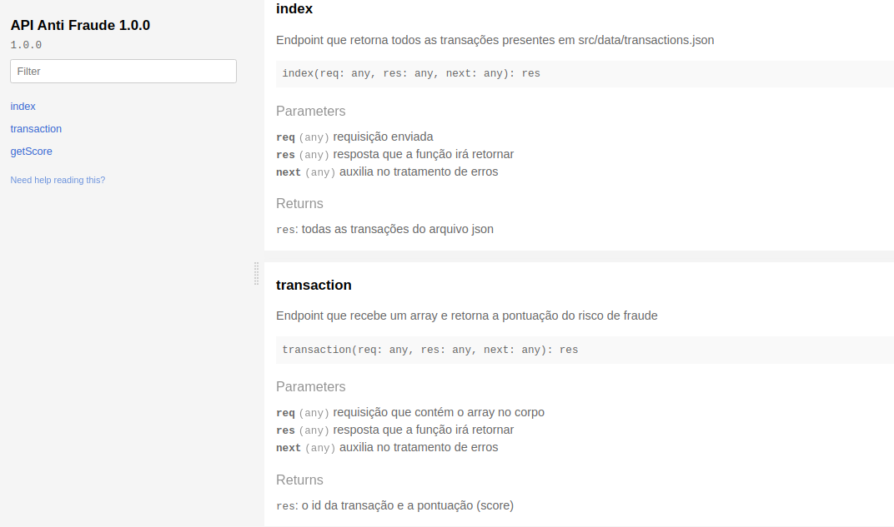

# API Anti-Fraude

Aqui ficará um breve resumo (...)


### Tecnologias usadas

- [Visual Studio Code](https://code.visualstudio.com/)
- [Postman](https://www.postman.com/)
- [Node.js](https://nodejs.org/en/)

### Pacotes

- [Nodemon](https://nodemon.io/)
- [Express.js](https://expressjs.com/pt-br/)
- [Documentation.js](https://github.com/documentationjs/documentation)
- [Celebrate](https://github.com/arb/celebrate)

## Documentação

A documentação foi gerada em HTML através do pacote Documentation.js. O arquivo de documentação está em **docs/index.html**:



## Testes

Para os testes, não houve a necessidade de automatizar ou implementar métodos rebuscados, porém usei o Postman para realiza-los. Criei uma *Collection* e **salvei os endpoints** para testar mais facilmente. Veja a imagem abaixo:


Na seção **Usando a API** você poderá ver uma imagem da requisição que verifica a transação. Além disso, existem validações feitas com o Celebrate para a entrada correta de dados no endpoint.

## Rodando o projeto

Faça um clone do repositório:
```
git clone https://github.com/RafaelEmery/desafio-upnid.git
```

Instale as dependencias referenciadas em *package.json*:
```
npm install
```

Rode no servidor local *https://localhost:3000*:
```
npm start
```

## Usando a API

A principal funcionalidade está em um **endpoint que recebe via POST** um array contendo a transação a transação, e será retornado um array contendo o id da mesma e a **score**, que representa o risto de fraude. Veja um teste do Postman abaixo.


Acima, vemos um array de transação sendo passado e o array de resposta sendo retornado junto com um status 200 (OK).

## Algoritmo e pontuação

Para realizar a pontuação, usei como base 4 parâmetros, presentes no arquivo *score.js*:
- Caso o nome do cliente e o nome presente no cartão sejam diferente (**40 pontos**).
- Caso a localização da compra seja diferente da localização do usuário (**40 pontos**).
- Caso o comprador seja menor de idade, visto que é não é comum menores realizarem compras e ter cartão de crédito (**10 pontos**).
- Caso o valor da compra seja acima da média de valores das transações do ecommerce (**10 pontos**). A média foi feita a partir do *JSON* de transações passadas no desafio.

**OBS**: Os casos que contam 40 pontos são considerados como **"evidencias" mais graves de uma possível fraude**, enquanto os de **10 pontos são mais moderadas** que podem acontecer em situações normais, porém devem ser analisadas.

## Gestão e organização

Para conseguir ser mais produtivo no desenvolvimento, utilizei:
- O Trello para anotar requisitos/referencias e gerenciar tarefas.
- A ferramenta e extensão do Chrome Clockify para marcar e metrificar o tempo gasto. O tempo gasto total foi de aproximadamente (pode ter sido um pouco mais) 5,2h, ou seja, **5 horas e 12 minutos**.
- Commits pequenos e descritivos para complementar na gestão de tarefas

## Considerações finais

- Inseri o *JSON* de transações no projeto para poder fazer uma requisição GET que retorna todas transações.
- Busquei variar em algumas situações, como na validação para os parâmetros da requisição, mas procurei me manter no escopo. Acredito que devemos manter a solução simples.
- Minha experiencia foi absolutamente "fora da caixa". Nunca havia pensado nas regra que envolviam a prevenção de fraudes em ecommerce. Foi divertido e aprendi muito!


Feito com :hearts: para Upnid por [Rafael Emery](https://rafaelemery.github.io)

